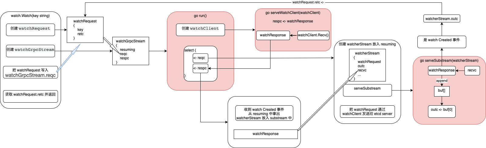

etcd watch procedure
===
1. watcher.Watch(key string)

key 被放进了`watchRequest`中，watchRequest 中有个 `retc`，最终会把 retc 中的 chan 返回给调用方。

1.1 然后会创建一个 `watchGrpcStream`，放入watcher 的streams map。

    watchGrpcStream 的关键成员变量是 reqc 和 respc。
    watchGrpcStream 在创建时就会起一个 goroutine 执行 run()，其中会读 reqc。
    run 中首先会创建 watchClient，就是和 etcd server 通信用的。创建完了会起一个 goroutine 执行 serveWatchClient(watchClient)，这里面会把收到的 watchResponse 写入 respc。
    然后会去 select 读取 reqc 和读取 respc。

把 watchRequest 写入 watchGrpcStream.reqc，然后就读取 watchRequest.retc，并返回读到的 chan，这个 chan 就是实际产生 key 的更新时，用来写入事件的。

    watchGrpcStream.run 中读取到 reqc 后，就会先创建一个 watcherStream，后面会记录下来。内含 watchRequest，以及最重要的 outc 和 recvc。
    然后再起一个 goroutine 执行 serveSubstream(watcherStream)。
    然后再把 watchRequest 通过 watchClient 发给 etcd server，里面有 key。
    这样 respc 就会开始收到 watchResponse。首先是 watch Created 事件。收到后先把 watcherStream 记录下来，然后将 watchResponse 写入 watcherStream.recvc。

1.2 `serveSubstream` 中会去死循环 select 写入 outc 和读取 recvc。

    recvc 收到 watchResponse 后，先判断是否为 watch Created 事件，是则将 outc 写入 watchRequest.retc，即最终会返回给调用方，来读取 watch 事件。
    若不是 watch Created 事件，则将 watchResponse 放入 buf（无长度限制）。然后循环开头会去将 buf[0] 写入 outc。

